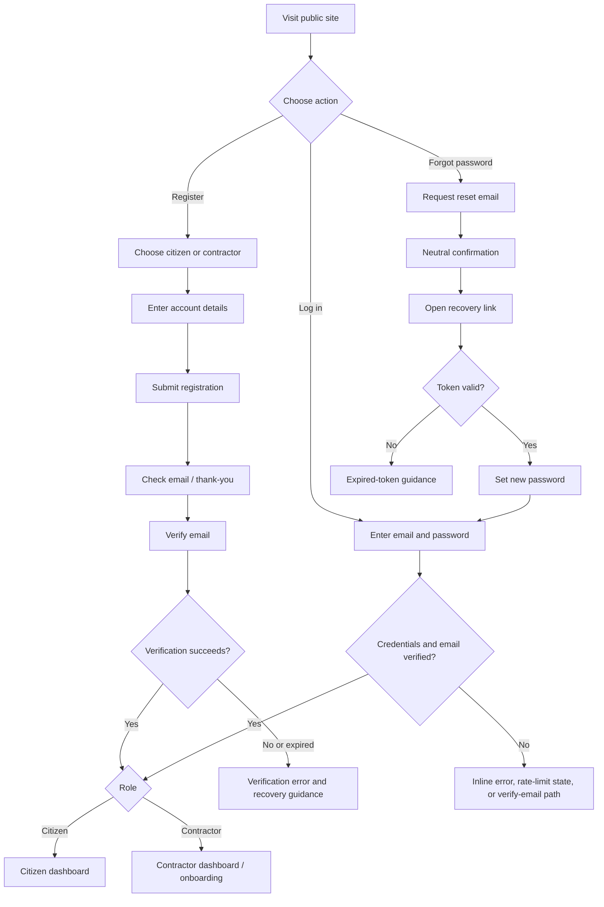
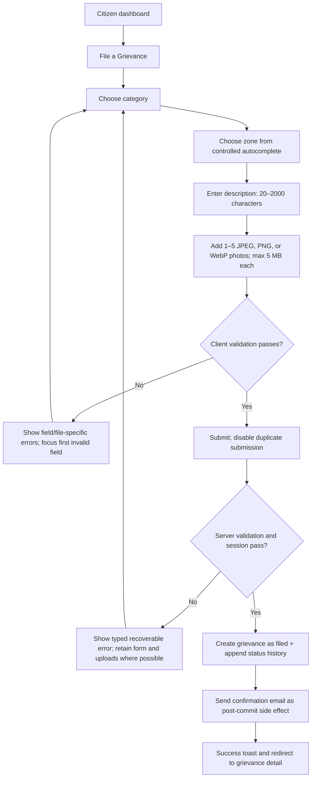
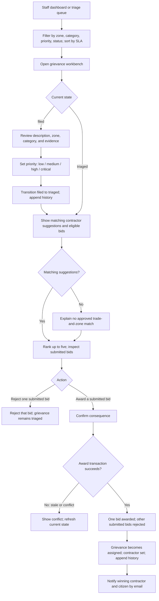
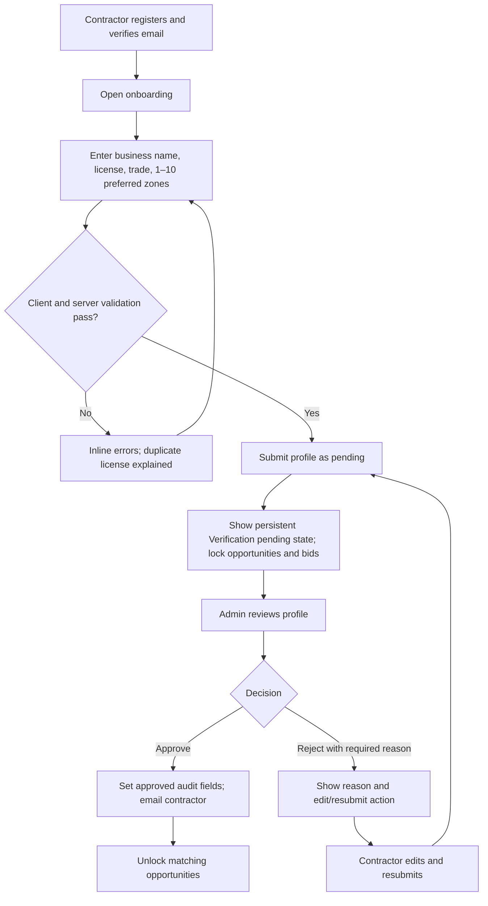
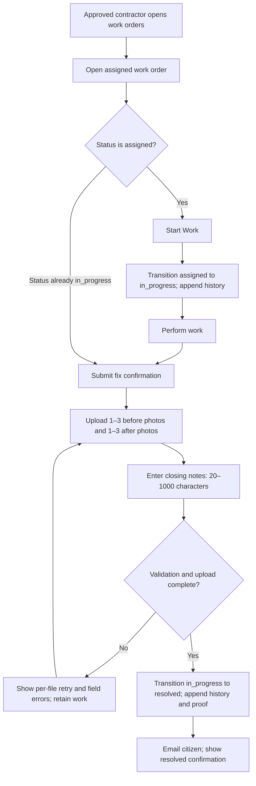

# NagarSaathi — User Flows

**Scope:** Phase 1 · Single municipal deployment · Responsive web  
**Source documents:** `PRD.md`, `design.md`, `architecture.md`  
**Canonical grievance lifecycle:** `filed → triaged → assigned → in_progress → resolved`

---

## 1. Global entry, authentication, and access

### Account and session rules

- Public routes: `/`, `/login`, `/register`, `/verify`, `/forgot-password`, `/reset-password`, `/thank-you`, `/404`.
- Public registration offers **citizen** or **contractor** only. Staff/admin accounts are provisioned by municipal IT/admin tooling.
- New accounts must verify email. Supabase Auth uses PKCE and secure HttpOnly cookies. Unverified users are routed to verification; mutations re-check the verified session.
- Login is rate-limited after 5 failed attempts in a 15-minute window per the auth protection rules. Password recovery uses neutral success copy so account existence is not disclosed.
- After authentication, users land on their role dashboard. Wrong-role route access redirects to the user’s own dashboard. Middleware improves navigation; RLS is the actual data boundary.
- No grievance data is available to anonymous visitors. An inaccessible grievance uses a not-found response, not a revealing forbidden page.

### Global route outcomes

| Condition | Outcome |
|---|---|
| Anonymous user opens protected route | Redirect to `/login` with return-path preservation. |
| Authenticated user opens `/login` or `/register` | Redirect to own role dashboard. |
| Authenticated user opens another role’s route | Redirect to own role dashboard; do not expose protected data. |
| Session expires during a form | Preserve a return path and route through login; recoverable form inputs should not be silently discarded where practical. |
| Realtime disconnects | Keep the page usable, show a non-blocking reconnecting indicator, auto-resubscribe, and re-fetch on reconnect to heal missed updates. |

## 2. Citizen flows

### 2.1 File a grievance

**Entry:** `/dashboard/citizen` primary CTA or `/dashboard/citizen/grievances/new`.  
**Goal:** create a complete `filed` grievance with evidence in under three minutes.

**Rules and recovery**

- `category_id`, zone, description, and photos are required. Zone must match the configured municipal list exactly; free text without a selection is invalid.
- Description is trimmed plain text, 20–2000 characters. Upload accepts 1–5 WebP/JPEG/PNG images, each no larger than 5 MB.
- Each file has its own preview, progress, success/error state, retry, and remove action. A failed upload must not erase other form input.
- The server creates status `filed`, priority `NULL`, citizen ownership, and a `filed` history row. Duplicate submit is guarded. Email failure does not undo a successful database commit.
- Success route: `/dashboard/citizen/grievances/[id]`; the Filed timeline entry is visible immediately.

### 2.2 Track a grievance

**Entry:** citizen dashboard, own-grievance list, or post-submit redirect.  
**Route:** `/dashboard/citizen/grievances/[id]`.

1. Server checks the authenticated citizen’s RLS-scoped access.
2. Show category, zone, description, filed photos, current status, priority when set, and the five-step timeline.
3. Expand a history entry to read its permitted notes, actor role, absolute timestamp, and attached evidence.
4. Once assigned, show the assigned contractor’s **business name** only.
5. Once resolved, show labeled before/after proof and closing notes; the citizen receives a resolution email with a link.
6. Subscribe to grievance and history changes. Re-query authorized data on events, announce meaningful changes politely, and show live/reconnecting state.

**Privacy:** do not show bid notes, other bidders, or staff-only information. PRD calls for internal notes to be hidden from citizens; the current architecture schema does not define a visibility field, so the Phase 1 data contract must be clarified before staff-only notes are introduced.

### 2.3 Browse own grievances and profile

- `/dashboard/citizen/grievances`: list only the signed-in citizen’s records, newest first, with status filtering. Clear filters when the filtered result is empty.
- `/dashboard/citizen/profile`: edit own name; email is read-only; password change is an entry point into the auth recovery/change flow.
- Direct access to another citizen’s ID returns not-found; UI hiding alone is insufficient—RLS must enforce ownership.

## 3. Staff flows

### 3.1 Triage, match, and award

**Entry:** `/dashboard/staff` urgent shortlist or `/dashboard/staff/queue`.  
**Work surface:** `/dashboard/staff/grievances/[id]`.

**Staff queue behavior**

- Default status filter is `filed` + `triaged`; filters are combinable and URL-persisted: zone, category, priority, status.
- Sort options: SLA urgency (default), newest, oldest. Search description with 300 ms debounce.
- SLA uses `critical` 12h, `high` 24h, `medium` 48h, `low` 72h; untriaged/null priority uses the 72h overall window. Overdue rises to the top under urgency sorting.
- Realtime inserts/updates appear without refresh; new entries receive a brief highlight and a polite announcement.

**Triage and bidding constraints**

- Priority is required before `filed → triaged`. Invalid or out-of-order transitions are rejected server-side.
- Suggestions include only approved contractors whose trade matches the grievance category and whose preferred zones contain its zone. Rank by fewest active work orders, then earliest approval; show at most five.
- There is no direct “invite to bid” notification in Phase 1. Eligible contractors see triaged opportunities organically.
- Staff can award only a submitted bid on a triaged grievance. Award is atomic. Concurrent award conflicts refresh the workbench; they must not create two winners.
- Rejecting an individual bid does not change grievance status.

### 3.2 Monitor operations and contractor directory

- `/dashboard/staff`: status counts, overdue count, and SLA-urgent shortlist; entries open in the queue/workbench.
- `/dashboard/staff/contractors`: read-only directory of approved contractors with trade, zones, and active work-order context.
- `/dashboard/staff/profile`: own profile only.

## 4. Contractor flows

### 4.1 Onboard and obtain approval

**Profile fields:** business name (2–120 characters), license number (4–60 characters; alphanumeric plus hyphen/slash; unique), trade category, preferred zones (1–10 configured zones). Municipal license-specific format rules are not defined in Phase 1.

### 4.2 Browse opportunities and submit a bid

1. Opportunity feed is accessible only when contractor profile status is `approved`.
2. RLS returns `triaged` grievances matching both the contractor’s trade and preferred zones, plus grievances already involving the contractor.
3. Open `/dashboard/contractor/opportunities/[id]`, inspect the grievance, and submit `bid_notes` (10–1000 characters) describing scope/approach/timeline.
4. A unique contractor/grievance constraint allows one bid. Bidding has no monetary amount or in-platform payment. Re-submission/edit after award decisions is not supported.
5. Bid appears in `/dashboard/contractor/bids` as submitted; realtime updates change it to awarded or rejected.

**Empty feed:** explain that matching work appears as grievances are triaged; do not imply the service is broken.

### 4.3 Execute an awarded work order

Only the assigned contractor can start or resolve that work. Resolution requires before/after evidence and closing notes. Phase 1 resolution is contractor-asserted; there is no citizen dispute or reopen flow.

## 5. Admin flows

### 5.1 Review contractor verification

1. Open `/admin/contractors`; default view is pending profiles.
2. Open a profile detail context and inspect business name, license, trade, zones, registrant email, and submission date.
3. **Approve:** confirm the action; set approved status and audit fields; notify the contractor; their matching opportunities unlock.
4. **Reject:** enter a required 10–500 character reason; confirm; store and surface the reason to the contractor; profile can be edited and resubmitted to pending.
5. Use approved/rejected tabs for review history. Decision failures refresh row state and preserve the reason where possible.

### 5.2 Observe and search

- `/admin`: review status counts, rolling 7/30-day average resolution time vs 72h, overdue counts by priority, time in state, contractor response rate, and pending verification age. Each metric widget has its own loading/error/empty state.
- `/admin/users`: search by name/email; paginate 25 users per page. Phase 1 is read/search only; do not show deactivation or role-change actions.
- `/admin/grievances`: read all statuses/zones and inspect history through a detail drill-in. Admin grievance writes are out of Phase 1 scope except approved reference-data and contractor verification operations.
- `/admin/profile`: own profile.

## 6. State and error recovery map

| Flow point | Failure/edge case | Expected response |
|---|---|---|
| Register/login | Duplicate/invalid details, unverified email, rate limit | Specific inline or neutral auth message; no account enumeration; show recovery path. |
| File grievance | Wrong file type/size, upload failure, invalid zone, session expiry | Per-file message and retry/remove; field-linked errors; preserve form state; redirect to login with return path if session expires. |
| Triage | Missing priority, stale status, unauthorized role | Reject server-side; show typed error and refresh current row; never append false history. |
| Award bid | Another staff member has already awarded/changed the grievance | Transactional conflict; show latest state; no duplicate award. |
| Onboarding | Duplicate license, invalid zone, admin rejection | Inline duplicate error; correct controlled values; display rejection reason and allow resubmission. |
| Bid | Already has a bid, no longer eligible, profile not approved | Prevent or explain action; refresh current eligibility; no duplicate bid. |
| Fix confirmation | Upload/validation failure, state changed elsewhere | Per-file retry, retain notes/files where possible, refresh status on conflict. |
| Realtime | Connection interruption or duplicate delivery | Keep stale UI marked as reconnecting, auto-rejoin, re-fetch on reconnect, deduplicate events. |
| Any protected resource | User lacks access or row does not exist | Not-found treatment; no resource existence disclosure. |

## 7. Cross-flow invariants

- Grievance transitions are forward-only; every transition writes an actor and timestamp to append-only history.
- The role and ownership guard is repeated on every Server Action; RLS scopes reads/writes independently of client UI.
- Realtime event payloads are invalidation signals; surfaces re-fetch authorized data rather than trusting event payloads.
- Emails are post-commit side effects. Failed email delivery must not undo a committed workflow transition.
- Status, bid, verification, and priority labels are canonical across all routes and use their specified semantic badges.
- Phase 1 excludes anonymous grievance access, maps, SMS, multi-language, payment, reopen/dispute, direct bid invitations, user deactivation, and multi-city support.
